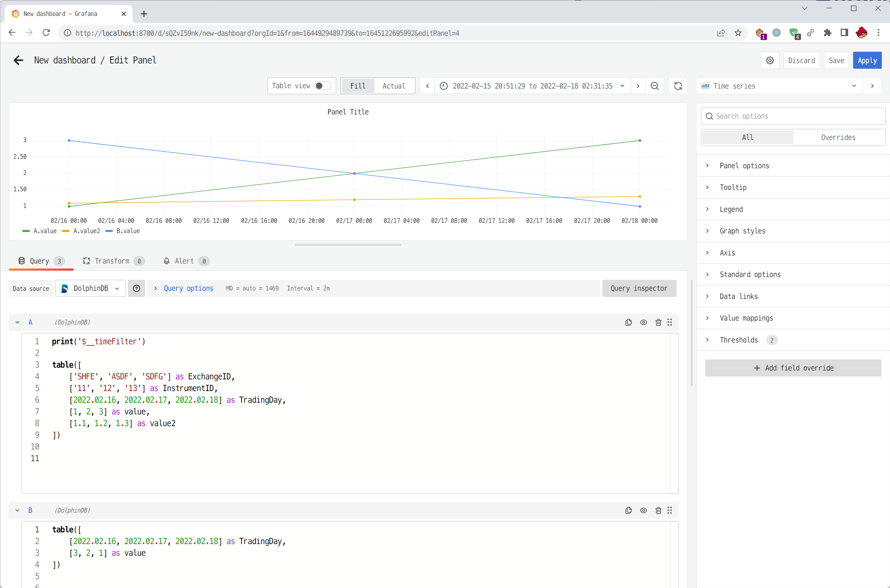

# DolphinDB Grafana DataSource Plugin

<p align='center'>
    
</p>

<p align='center'>
    <a href='https://github.com/dolphindb/api-javascript' target='_blank'>
        
    </a>
</p>

## English | [中文](./README.zh.md)

Grafana is an open source data visualization web application that is good at dynamically displaying time series data and supports multiple data sources. Users can display data graphs in the browser through Grafana by configuring the connected data source and writing query scripts

DolphinDB has developed a Grafana data source plugin (dolphindb-datasource), which enables users to write query scripts on the Grafana panel (dashboard), interact with DolphinDB (based on WebSocket), and visualize DolphinDB time series data



## Installation
### 1. Install Grafana
Go to Grafana official website: https://grafana.com/oss/grafana/ , install the latest open source version (OSS, Open-Source Software)

### 2. Install the dolphindb-datasource plugin
In Releases (https://github.com/dolphindb/grafana-datasource/releases) download the latest version of the plugin zip, such as `dolphindb-datasource.2022.xx.xx.xx.zip`

Unzip the dolphindb-datasource folder in the compressed package to the following path:
- Windows: `<grafana installation directory>/data/plugins/dolphindb-datasource`
- Linux: `/var/lib/grafana/plugins/`

If the plugins level directory does not exist, you can manually create this folder

### 3. Modify the grafana configuration file to allow loading the unsigned dolphindb-datasource plugin
Read the following documents to open and edit configuration files
https://grafana.com/docs/grafana/latest/administration/configuration/#configuration-file-location

Uncomment `allow_loading_unsigned_plugins` in `[plugins]` section and change to `dolphindb-datasource`
````ini
allow_loading_unsigned_plugins = dolphindb-datasource
````

Note: Grafana needs to be restarted every time a configuration item is modified

### 4. Restart the Grafana process or service
Open Task Manager > Services > Find Grafana Service > Right Click Restart

https://grafana.com/docs/grafana/latest/installation/restart-grafana/


### 5. Verify that the plugin is loaded
You can see a log similar to the following in the grafana startup log
````log
WARN [05-19|12:05:48] Permitting unsigned plugin. This is not recommended logger=plugin.signature.validator pluginID=dolphindb-datasource pluginDir=<grafana installation directory>/data/plugins/dolphindb-datasource
````

The log file path might be:
- Windows: `<grafana installation directory>/data/log/grafana.log`
- Linux: `/var/log/grafana/grafana.log`

Or visit the link below, you can see that the DolphinDB plugin on the page is in the Installed state
http://localhost:3000/admin/plugins?filterBy=all&filterByType=all&q=dolphindb


## Instructions
### 1. Open and log in to Grafana
Open http://localhost:3000
The initial login name and password are both admin

### 2. Create a new DolphinDB data source
Open http://localhost:3000/datasources or click `Configuration > Data sources` in the left navigation to add a data source, filter and search for dolphindb, configure the data source and click `Save & Test` to save the data source

Note: The new version of the plugin uses the WebSocket protocol to communicate with the DolphinDB database. The URL needs to start with `ws://` or `wss://` in the database configuration. Users upgrading from the old version of the plugin need to change the database URL from `http://` ` or `https://` to `ws://` or `wss://`

### 3. Create a new Panel, write query scripts, and visualize DolphinDB time series data
Open or create a new Dashboard, edit or create a new Panel, select the data source added in the previous step in the Data source property of the Panel
Write a query script, the last statement of the code needs to return a table
After writing, press `ctrl + s` to save, or click the refresh button on the page (Refresh dashboard), you can send the Query to the DolphinDB database to run and display the chart  
The height of the code editing box can be adjusted by dragging the bottom

The dolphindb-datasource plugin supports variables, such as:
- `$__timeFilter` variable: the value is the time axis interval above the panel. For example, the current time axis interval is `2022-02-15 00:00:00 - 2022.02.17 00:00:00` , then the ` $__timeFilter` will be replaced with `pair(2022.02.15 00:00:00.000, 2022.02.17 00:00:00.000)`
- `$__interval` and `$__interval_ms` variables: the value is the time grouping interval automatically calculated by grafana based on the length of the time axis interval and the screen pixels. `$__interval` will be replaced with the corresponding duration type in DolphinDB; `$__interval_ms` will be replaced with the number of milliseconds (integer)
- query variable: Generate dynamic value or list of options via SQL query

For more variables see https://grafana.com/docs/grafana/latest/variables/


To view the message output by `print('xxx')` in the code, or the code after variable substitution (interpolation), you can press `F12` or `Ctrl + Shift + I` or `Right click > Inspect` to open the browser development Or debug tools (devtools), switch to the console (Console) panel to view

### 4. Learn how to use Grafana by referring to the documentation
https://grafana.com/docs/grafana/latest/


### FAQ
Q: How to set the automatic refresh interval of the dashboard?
A:
Open the dashboard, click the drop-down box to the right of the refresh button in the upper right corner to select the automatic refresh interval.
If you need to customize the refresh interval, you can open `dashboard settings > Time options > Auto refresh`, enter a custom interval
If you need a refresh interval smaller than 5s, such as 1s, you need to do the following:
Modify the grafana configuration file
````ini
[dashboards]
min_refresh_interval = 1s
````
Restart grafana after modification
(Reference: https://community.grafana.com/t/how-to-change-refresh-rate-from-5s-to-1s/39008/2)


## Build and development
```shell
git clone https://github.com/dolphindb/grafana-datasource.git

cd grafana-datasource

npm i --force

# 1. Build the plugin
npm run build
# The finished product is in the out folder. Rename out to dolphindb-datasource and compress it to .zip


# 2. Develop plugins
npm run dev
# Soft link the out folder to the grafana plugins directory
flink('d:/grafana-datasource/out/', 'e:/sdk/grafana/data/plugins/dolphindb-datasource/')

# restart grafana
````
