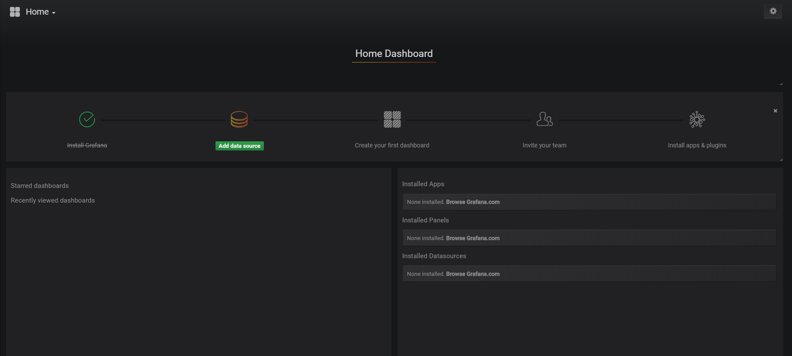

## 概述

grafana是一个开源的基于web的数据展示工具，它擅长做时序数据的动态展示，因此DolphinDB里内置了对grafana 的数据接口，同时也提供了grafana的dolphindb-datasource插件，只需要在grafana内安装dolphindb-datasource，就可以通过简单的脚本将dolphindb的table以直观的方式展示在web页面上。

## 安装DolphinDB(需要0.8版本以上)
参考以下文档:

* 中文版 ：https://github.com/dolphindb/Tutorials_CN/blob/master/README.md
* English version ：https://github.com/dolphindb/Tutorials_EN/blob/master/README.md

## 安装并启动grafana
参考文档

http://docs.grafana.org/installation/


## 安装 grafana-dolphindb-datasource
1. 请从 http://www.github.com/dolphindb/grafana-datasource 下载插件源码
1. 启动grafana之后，在grafana的根目录下会生成一个data目录，而dolphindb的datasource的插件需要将github下载的源码从根目录开始手工拷贝到grafanax.x.x/data/plugins/dolphindb-datasource/目录下.
1. 重新启动grafana,
通过 [http://localhost:3000] 访问系统，经过登录(admin:admin)、修改初始密码之后，系统界面如下
 
1. 设置grafana datasource
    1. 进入 add datasource 界面，如图
    
    2. name: datasource的名称，可以随意取。
    3. type下拉列表中请选择dolphindb
    4. 假设dolphindb安装在本机，node端口为8848，那么url设置如下 ： http://localhost:8848/grafana
    5. 其他项保持默认值
    6. 点击Save & Test,出现绿色的提示成功

## 实例
下面我们通过一个小例子来学习如何在grafana里展示dolphindb的数据表

### 背景介绍
在这个例子里，我们先通过一段脚本模拟生成实时数据(假设是温度传感器定时上传的温度数据)，然后在grafana里，通过定义一个graph来实时展示温度变化趋势。

### 创建 dolphindb 数据源 
如下脚本在DolphinDB Server上创建一个内存表temperatureTable，并且定时(1s)向表里写入温度数据，持续200秒。
```
n=100000
t1=streamTable(n:0, `temperature`ts,[DOUBLE,TIMESTAMP])
share t1 as temperatureTable
t1=NULL
def writeData(){
	for (i in 0:200) {
		data = table(rand(35..50,1) as temperature,now()  as ts)
		temperatureTable.append!(data)
		sleep(1000)
	}
}
submitJob("jobId20180817001","writeDataToStreamingTable",writeData)
```

### 编写Graph Panel Query

首先在dashboard里创建一个graph 类型的panel，切换到metrics tab 里选择dolphindb数据源后，添加Query
```
select gmtime(ts) as time_sec,temperature as serie1 from temperatureTable where ts> now()-5*60*1000
```
读取前5分钟的数据

关于如何创建Dashboard及panel请参考
http://docs.grafana.org/guides/getting_started/

### 界面动态显示
关于取到数据之后，界面上如何动态展示数据，请参考

http://docs.grafana.org/guides/getting_started/

## 关于时间的特殊处理
1. 标准UTC时间的转换

    由于grafana对于取到的数据都会当做UTC标准时间来处理，所以如果我们数据源保存的时间数据不是UTC标准时间的话，进入到grafana里面就会发生识别误差，所以在写Query返回时间值的时候，请务必带上dolphindb内置的标准时间转换函数gmtime(time_field).

 2. 根据移动时间区间抓取数据
 grafana显示流数据是定时抓取数据的方式，系统提供了抓取数据频率的设置，如图：
 

而这种取数据的方式存在一个缺点，每次取都要取出全量数据，如果server端没有做好数据结转的话，那么浏览器很快就会被越来越多的数据卡死。为了避免每次抓取的数据无止境的递增，我们提供了几种抓取移动的时间区间内的数据的方式。

取过去5分钟内数据
```
select gmtime(time_field),price as series1 from [table_name] where time_field > now()-5*60*1000
```

根据grafana设置的时间段来过滤数据(这个时间段grafana会根据浏览器时间自行推移)
```
select gmtime(time_field),price as series1 from [table_name] where time_field between $__timeFilter
```
这里使用 `$__timeFilter` 宏变量来替换当前grafana系统设置的区间值，`$__timeFilter` 会被替换成如下格式
2018.08.14T11:12:13.001:2018.08.18T23:59:59.999