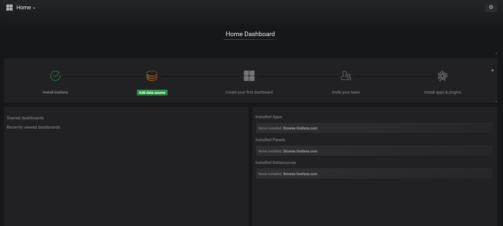
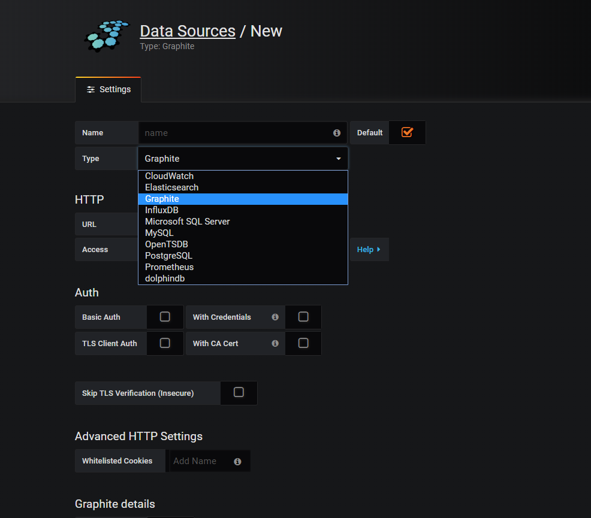
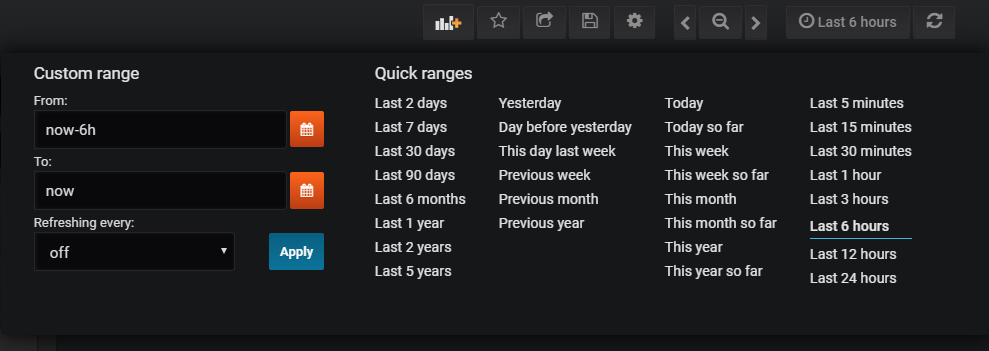

Grafana是一个开源的基于web的数据展示工具，擅长动态展示时序数据。它内部支持多种数据源，也支持以插件方式对数据源进行扩展。DolphinDB为了支持使用Grafana来实时展示时序数据，提供了Grafana的dolphindb-datasource插件，并且实现了对Grafana的HTTP数据接口，可以通过类SQL的查询脚本将DolphinDB的数据表以直观的方式展示在Grafana的Dashboard上。

### 1 安装DolphinDB

参考以下文档：

* 中文版 ：https://github.com/dolphindb/Tutorials_CN/blob/master/README.md
* 英文版 ：https://github.com/dolphindb/Tutorials_EN/blob/master/README.md

### 2 安装并启动Grafana

参考文档
http://docs.grafana.org/installation/

### 3 安装 grafana-dolphindb-datasource
在安装数据源插件之前，请从http://www.github.com/dolphindb/grafana-datasource下载插件源码压缩包，将插件源码解压到"grafanax.xx/data/plugins/"目录之下的一个目录，然后把该目录重命名为"dolphindb-datasource"。重启Grafana，新插件会被自动载入。

接下来可以通过Grafana的设置界面配置dolphindb-datasource插件以设置数据源。具体步骤如下：

- 登录进入系统，界面如下

 

- 进入"Add data source"界面，如图


- name: data source的名称，可以随意取。
- type下拉列表中请选择DolphinDB
- 若DolphinDB安装在本机，node端口为8848，那么url可设置成：```http://localhost:8848/grafana```
- 其他选项保持默认值
- 点击"Save & Test", 出现绿色的提示成功

### 4 实例

我们通过一个简单例子来说明如何在Grafana里实时展示DolphinDB的数据。

#### 4.1 创建 DolphinDB 数据源 

在DolphinDB中创建一个内存表"temperatureTable"，每秒钟向表里写入温度数据，持续200秒。

```
n=100000
t1=streamTable(n:0, `temperature`ts,[DOUBLE,TIMESTAMP])
share t1 as temperatureTable
t1=NULL
def writeData(){
	for (i in 0:200) {
		data = table(rand(35..50,1) as temperature,now() as ts)
		temperatureTable.append!(data)
		sleep(1000)
	}
}
submitJob("jobId","writeDataToStreamingTable",writeData)
```

#### 4.2 设计Grafana的图形面板及数据查询语句

首先在dashboard里创建一个Graph类型的panel，通过panel header下拉菜单点击"edit"进入panel编辑界面，切换到"metrics"页面 选择定义好的DolphinDB数据源后，数据源下方会出现一个用于输入脚本的文本输入框，输入以下查询语句以读取前5分钟的数据。
```

select gmtime(ts) as time_sec, temperature as serie1 from temperatureTable where ts>now()-5*60*1000
```
保存并回到dashboard，在右上角设置定时刷新及数据时间段的长度，就可以看到实时的温度变化走势图。

具体Grafana操作，可以参考[Grafana官方教程](http://docs.grafana.org/guides/getting_started/)


### 5 关于时间数据处理的注意事项

- 标准UTC时间的转换

由于Grafana对于输入的时间数据都会当做UTC标准时间来处理，所以如果我们数据源的时间数据不是UTC标准时间的话，进入到Grafana就会发生识别误差。如果Grafana server安装在美国西五区的服务器上，DolphinDB在西八区服务器上，DolphinDB保存了一个时间数据```09:30:01```，对应的西五区时间是```12:30:01```，Grafana server如果在未作转换的情况下取到这个数据之后，会默认认为这是UTC时间，然后会对这个数据做本地化时区转换，即```09:30:01-5小时=04:30:01```，所以只有先把西八区的```09:30:01```转换成对应的UTC时间```17:30:01```，Grafana才能正确处理并显示正确的时间。

在DolphinDB中产生UTC时间：
```
select gmtime(ts) as time_sec,temperature as serie1 from temperatureTable
```

 - 根据移动时间区间抓取数据

Grafana采用指定移动时间区间，定时抓取数据的方式以显示流数据。可在Grafana系统中设置抓取数据的时间区间及频率，如图：

 

DolphinDB提供了几种抓取移动的时间区间内的数据的方式。

取过去5分钟内数据：
```
select gmtime(time_field),price as series1 from [table_name] where time_field > now()-5*60*1000
```

根据在Grafana中设置的时间段来过滤数据(这个时间段Grafana会根据浏览器时间自行推移)：
```
select gmtime(time_field),price as series1 from [table_name] where time_field between $__timeFilter
```
这里使用宏变量`$__timeFilter`来替换Grafana系统中设置的区间值。